# Benefits Market Intelligence

**Where broker compensation in the U.S. employee benefits market is growing, who is capturing it, and where a brokerage should compete next.** Built on six years of public Form 5500 filings (form years 2019 to 2024).

[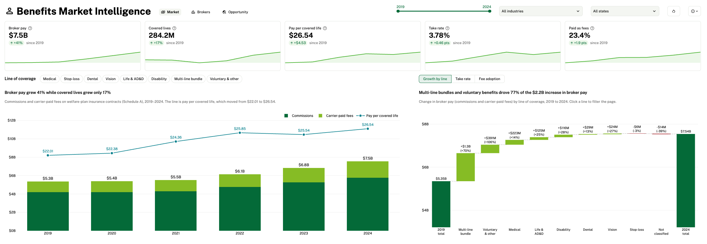](https://benefits-market-intelligence.streamlit.app/)

Check out the [live link here.](https://benefits-market-intelligence.streamlit.app/)

**Data freshness:** covers form years 2019 to 2024, using every filing EFAST had received by **September 24, 2026** (the latest receipt date in the data). DOL rebuilds these files about monthly as late and amended filings arrive, so rerunning `make data` picks those up for the same six form years. It never adds 2025 or later. Form year 2024 is still filling in (see [assumptions](docs/assumptions.md#filing-window)).

===

## The Business Problem

Employee benefits brokers earn billions of dollars a year in commissions and fees for placing and servicing employer health, life, disability and voluntary coverage. Yet the biggest growth decisions a brokerage makes, such as which products to lead with, which employers to target and which competitors to watch, are usually made on anecdote and relationships rather than market data.

The data to answer those questions already exists. Every ERISA-covered benefit plan files an annual **Form 5500** with the Department of Labor disclosing its insurers, its premiums and what its brokers were paid. But it is spread across **5.1M self-reported records**, three separate disclosures and six years of files, and it is not usable as-is.

This project turns those filings into a market view that answers four questions:

1. **Market size:** How large is the broker compensation pool, and is it outgrowing the market it serves?
2. **Growth drivers:** Which lines of coverage and pay structures are driving that growth?
3. **Competition:** Which brokerage firms are gaining share, and who are they taking it from?
4. **Opportunity:** Which employer segments, industries and states have the most room to grow?

---

## Key Findings

### 1. Broker pay is growing more than twice as fast as the market it serves

Disclosed broker compensation rose from **$5.35B to $7.56B (+41%)** between 2019 and 2024, while covered lives grew just **17%**. Pay per covered life climbed from $22.01 to $26.64, and the market-wide take rate (broker pay as a share of premium) rose from 3.32% to 3.78%.

<details>
<summary>View chart</summary>

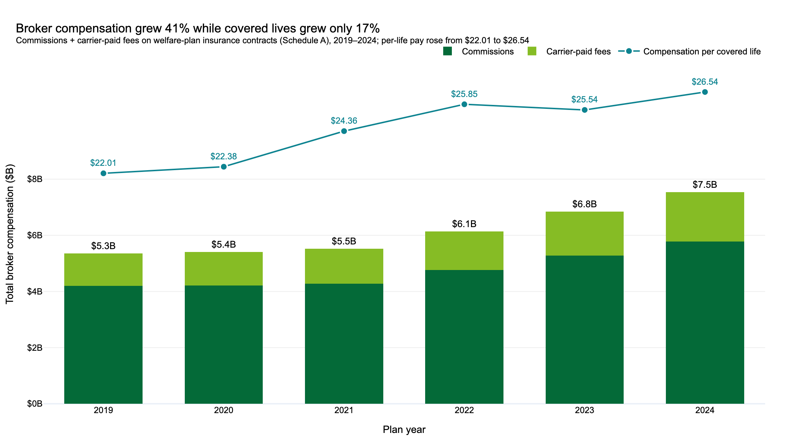

</details>

### 2. Bundles and voluntary benefits drove 77% of the growth, not medical

Multi-line bundles (**+$1.3B, +71%**) and voluntary benefits (**+$389M, +105%**) account for 77% of the $2.2B increase. Medical, the largest line by premium at $87.9B, added only $234M, and its take rate slipped to 2.08%. Voluntary is now the most lucrative line per premium dollar, with take rates rising from **10.4% to 13.5%**.

<details>
<summary>View charts</summary>

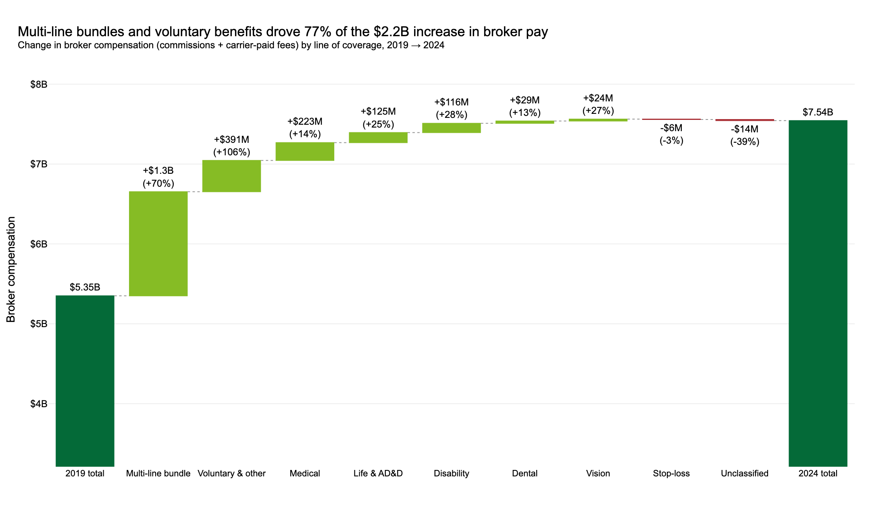
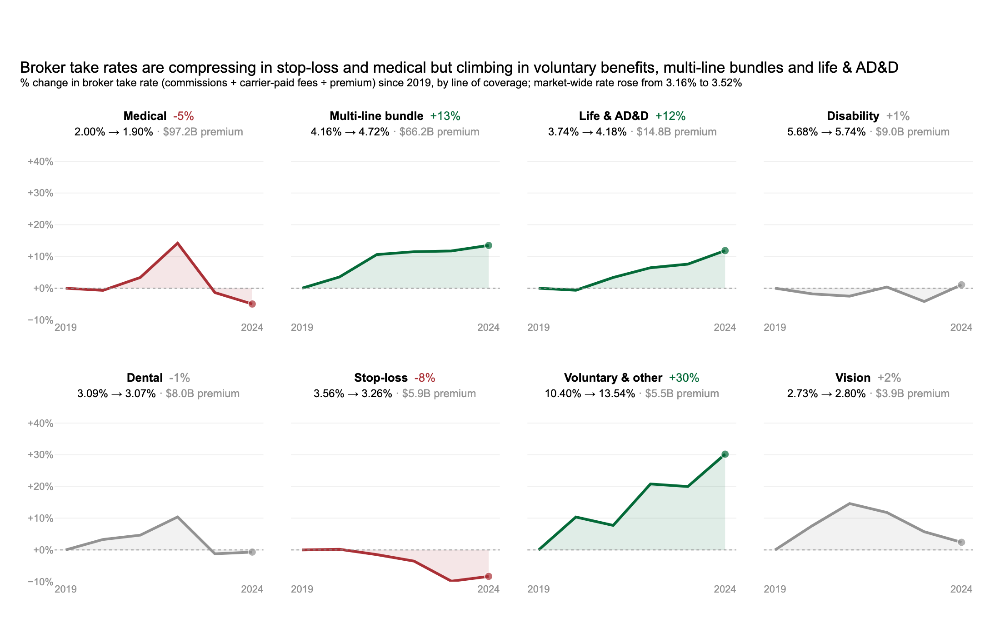

</details>

### 3. Carriers are paying brokers more through fees, especially outside medical

Carrier-paid fees (bonuses, overrides and service fees) now make up **23.4%** of broker pay, up 1.8 points since 2019. Fees are becoming standard on disability (55% to 67% of contracts), multi-line bundles (55% to 65%) and life (51% to 61%), while medical, dental and stop-loss are flat.

<details>
<summary>View chart</summary>

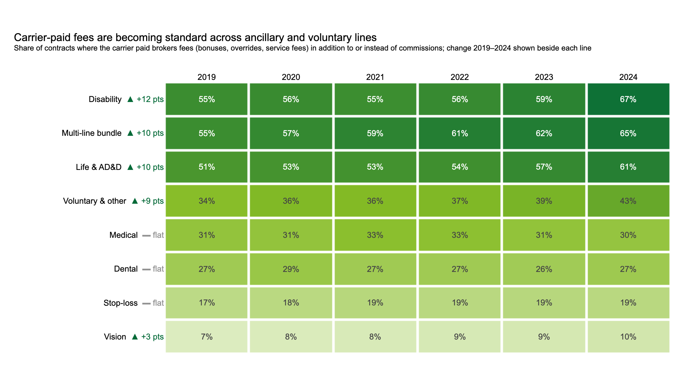

</details>

### 4. Employers are changing what they buy

Self-funding is moving down-market: the share of **100-249-participant** health plans without insured medical rose **4.9 points**, the fastest of any size band, while it fell 1.6 points among 5,000+ employers. Voluntary benefits adoption rose in **every** size band, led by 1,000-4,999-participant plans (+9.6 points to 63%). Stop-loss, the product that makes self-funding possible, is not following suit for brokers: its pay pool shrank 3% and its take rate compressed 8%, though that decline disappears if contracts with blank pay are left out instead of counted as zero ([details](docs/assumptions.md#blank-amounts)).

<details>
<summary>View charts</summary>

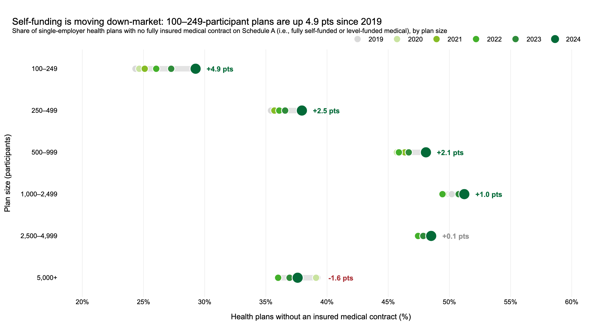
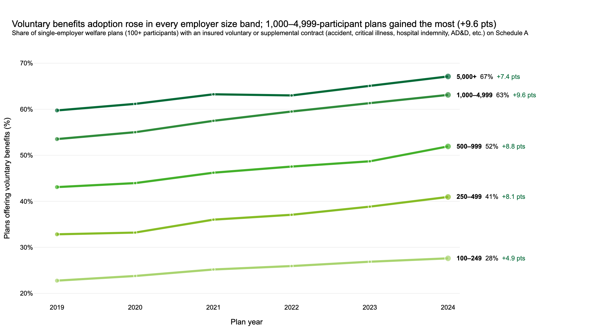

</details>

### 5. Mid-market consolidators are taking share from the global consultancies

Among large single-employer welfare plans, **OneDigital** grew from 45 to 170 client plans (+278%) to become the most-named firm, **AssuredPartners** grew 412% and **Marsh McLennan Agency** doubled. Over the same period WTW (-8%), Aon (-32%), Mercer (-29%) and HUB (-32%) slipped. The winners grew by absorbing local brokers' clients: OneDigital won 80 plans from local brokers for a net gain of 46, while WTW lost 79 plans and won 21 for a net loss of 58.

<details>
<summary>View charts</summary>

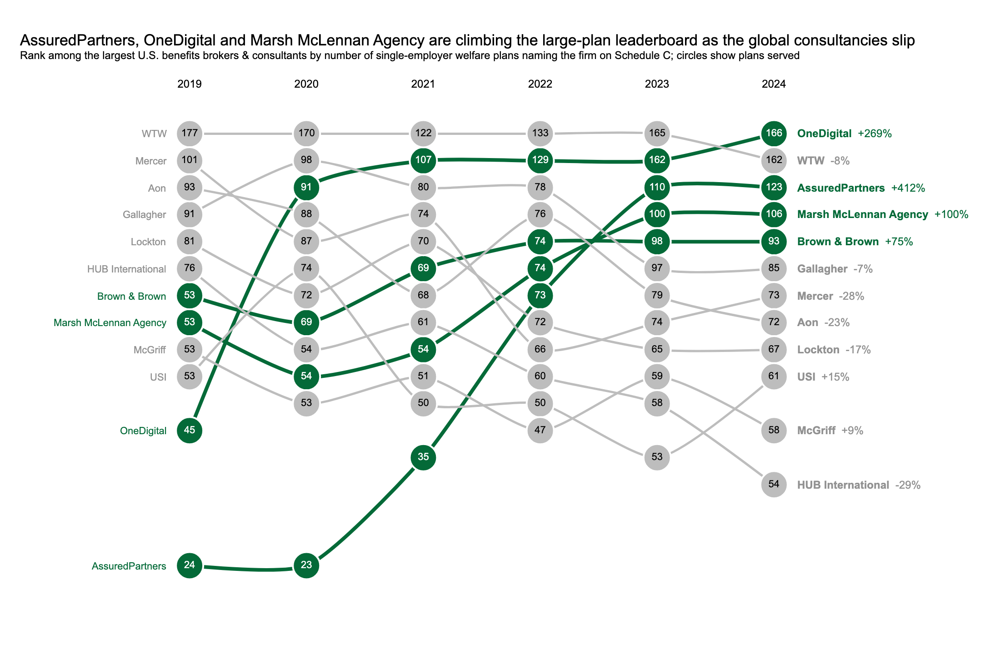
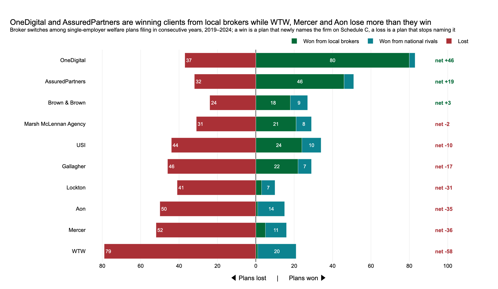

</details>

### 6. Growth is uneven across industries and states

Manufacturing ($1.3B), Health Care ($1.2B) and Professional & Technical Services ($1.1B) are the largest pools. **Admin & Support Services is growing fastest** among the top 10 (+70%), though nearly all of its lead over the national rate comes from five large plans, while Construction (+65%) holds up without its biggest movers. By state, **Arizona (+96%), Texas (+58%), Michigan (+57%) and Illinois (+56%)** lead, and each still beats the national rate with its five fastest-growing plans taken out (Arizona +58%). California, the largest market, trails the national rate at +32%.

<details>
<summary>View charts</summary>

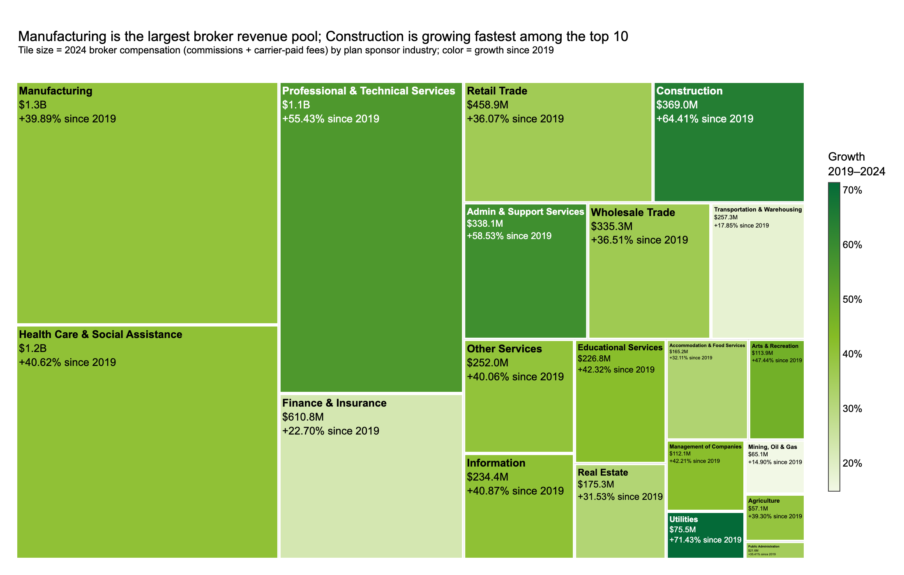
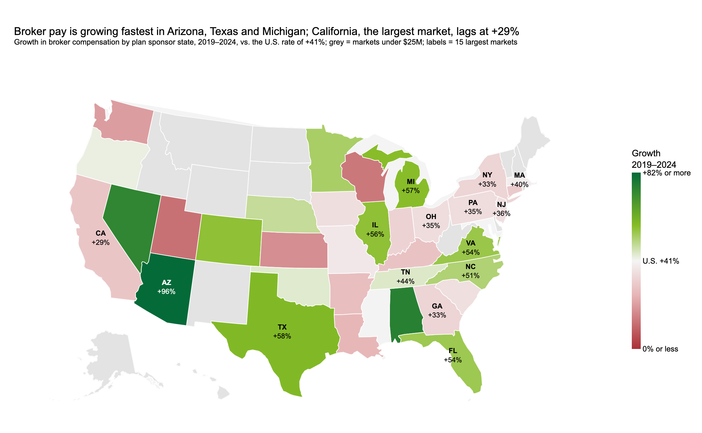

</details>

---

## Recommendations

For a benefits brokerage deciding where to invest its sales, product and talent. Each carries a call (Go, No-go or Monitor) and a confidence level, rated with the rubric in [assumptions](docs/assumptions.md#confidence-ratings).

1. **Sell the bundle, not just the medical plan.** *Go, high confidence. Medical commissions as a growth engine: No-go, high confidence.* Medical is the largest premium line, but its take rate is flat at about 2%. Margin is expanding in multi-line bundles (5.2% and rising) and in life and disability, where carriers increasingly pay fees on top of commissions. Use the medical renewal as the door-opener and lead with a bundled ancillary strategy.
2. **Build a voluntary benefits practice aimed at employers under 1,000 participants.** *Go, medium confidence, because "voluntary" is inferred from the other and indemnity benefit flags.* Voluntary carries the highest take rate in the market (13.5%) and its pay pool doubled, yet only 28% to 52% of plans under 1,000 participants offer it, compared with 63% to 67% of larger employers. Closing that gap is the most direct path to new revenue from the existing book.
3. **Get ahead of self-funding in the 100-499 segment, and price it as advice.** *Go, medium confidence, because self-funding is read from a missing insured medical contract. Stop-loss commissions: No-go, medium confidence.* Smaller employers are leaving fully insured medical faster than anyone else, so level-funded and stop-loss capabilities are becoming table stakes. Stop-loss won't carry that revenue: its broker pay shrank 3% while the market grew 41%, and nearly half of stop-loss contracts report no broker pay at all. Protect revenue with fee-based consulting or by pairing funding strategy with ancillary placements rather than relying on stop-loss commissions.
4. **Point sales capacity at the fastest-growing markets.** *Go, high confidence.* Prioritize Arizona, Texas, Michigan, Illinois, Florida and Virginia, which all grew in at least four of five years and still beat the national rate with their five fastest-growing plans taken out, along with Construction (+65%) and Professional & Technical Services (+55%, $1.1B). Admin & Support Services (+70%) is worth a look, but nearly all of its lead over the national rate comes from five large plans. California is the largest market but is growing well below the national rate.
5. **Use competitor tracking as an early-warning system.** *Monitor, medium confidence, because Schedule C covers only a thin slice of large plans.* Share in the large-plan market is moving to consolidators that pick up local brokers' clients, not to firms beating the global consultancies head-to-head. Independent brokers should expect their books to be targeted and differentiate on service, and every firm can use year-over-year win/loss data to flag at-risk accounts before renewal.

---

## Explore the Dashboard

The interactive Streamlit dashboard puts every finding behind filters for year range, industry and state, so the same questions can be answered for any segment of the market.

- **Market:** size of the broker pay pool, growth by line of coverage, take rates, fee adoption and carrier share of premium, with a switch to leave contracts with blank pay out of the rates
- **Brokers:** leaderboard, momentum and win/loss record for 22 national brokerage firms, with the filed names that count toward each firm
- **Opportunity:** growth by state and industry (with each state's growth shown without its five fastest-growing plans), plus self-funding and voluntary adoption by employer size
- **Accounts:** a searchable table of about 73,000 employer plans with their lines, carriers, broker pay, take rate against similar-sized plans, national firm and flags (self-funded, no voluntary, changed firm, amended filing, partial-year contract), downloadable as CSV and traceable to the filing by its ACK ID

Charts that back a recommendation show its call and confidence on the unfiltered view.

---

## Approach & Caveats

- **Source:** Public DOL EFAST Form 5500 datasets for form years 2019 to 2024 (the year printed on the form), combining the main form (plan and sponsor details), Schedule A (insurance contracts, premiums, commissions and fees) and Schedule C (service provider compensation).
- **Comparable years:** Each year includes only filings received within the standard deadline plus extension, deduplicated to one filing per plan per year, so older years with more late filings don't look artificially larger.
- **Clean dollars:** Contracts with impossible self-reported values (negative pay, extreme pay per covered life) are screened out. This removes under 2.5% of contracts, and yearly totals move by less than 4% under alternative thresholds.
- **Broker tracking:** 22 national firms are identified by name on Schedule C, with word-boundary patterns and exclusions for investment arms, law firms and look-alike names, and followed year over year to classify each client win and loss. See [`docs/name-matching.md`](docs/name-matching.md).
- **Scope:** Results describe the large-group market (100+ participants), since most small insured plans are exempt from filing. Dollars are nominal, and Schedule C does not capture every broker relationship.

Every rule and judgment call behind the numbers is documented in [`docs/assumptions.md`](docs/assumptions.md).

---

## Technical Details

### Data Pipeline

Raw filings are downloaded directly from the Department of Labor and refined in a **DuckDB** warehouse using a **Medallion architecture**. The gold layer feeds both the analysis notebook and the dashboard.

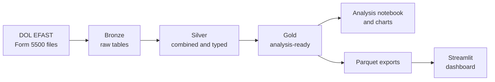

| Layer | Contents | Purpose |
|---|---|---|
| **Bronze** | Raw CSVs, one table per source file | Unmodified system of record |
| **Silver** | Six years combined per form, typed and standardized | Clean, query-ready history |
| **Gold** | Trimmed to analysis-relevant columns | Fast, analytics-ready tables |

Further documentation: [about the data](docs/about-the-data.md), [data transformations](docs/data-transformations.md), [data dictionary](docs/data_dictionary/README.md), [assumptions](docs/assumptions.md), [name matching](docs/name-matching.md), [sources](docs/sources.md)

### Tech Stack

| Tool | Role |
|---|---|
| **DuckDB** | Analytical warehouse and SQL engine for the pipeline and analysis |
| **pandas / PyArrow** | Data wrangling and columnar I/O |
| **Plotly + Kaleido** | Interactive charts and static exports |
| **Streamlit** | Interactive dashboard |
| **Jupyter** | Exploratory and final analysis |
| **uv / Ruff / ty** | Environment management, linting, formatting and type checking |
| **pytest / GitHub Actions** | Tests (100% coverage of the pipeline package) and CI on every push and pull request |

### Repository Structure

```
benefits-market-intelligence/
├── .github/workflows/        # CI: lint, format check, type check and tests
├── assets/                   # README images
├── data/exports/             # Gold tables as Parquet (powers the dashboard)
├── docs/                     # Data background, transformations, assumptions, name matching, sources, data dictionary
├── figures/                  # Exported charts (exploratory and final analysis)
├── notebooks/                # EDA per form/schedule and the final analysis notebook
├── src/benefits_market_intelligence/
│   ├── config/               # Shared paths
│   ├── elt/                  # Bronze, silver and gold pipeline scripts
│   └── visualizations/       # Shared chart styling and export
├── streamlit/                # Dashboard app (Market, Brokers, Opportunity, Accounts)
├── tests/                    # pytest suite for the pipeline, docs and dashboard
├── Makefile                  # Pipeline entry points (macOS/Linux)
└── pyproject.toml            # Dependencies and project metadata
```

### Running Locally

**Prerequisites:** Python 3.14 and [`uv`](https://docs.astral.sh/uv/)

```bash
git clone https://github.com/coreymichaud/benefits-market-intelligence.git
cd benefits-market-intelligence
uv sync
```

**Launch the dashboard:**

```bash
uv run streamlit run streamlit/app.py
```

**Rebuild the data from source:**

```bash
# macOS / Linux
make data

# Windows
uv run src/benefits_market_intelligence/elt/01_bronze.py
uv run src/benefits_market_intelligence/elt/02_silver.py
uv run src/benefits_market_intelligence/elt/03_gold.py
```

---

## License

This project is licensed under the [MIT License](LICENSE).